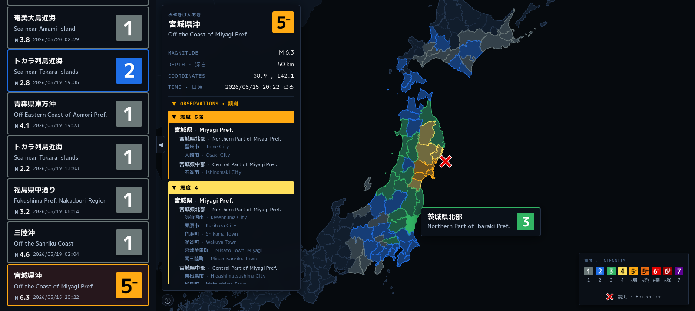

# WebQuake

Webapp that displays information from earthquake reports published by the Japan Meteorological Agency (JMA · 気象庁)



Live at https://webquake.hainaut.xyz

## Features

- List of part earthquakes (up to 7 days old)
- Description of the earthquake (Mangitude, Intensity,Date and Time, etc.)
- On map visualization of the epicenter, and recorded intensity by area
- Full list of localities sorted by their recorded intensity
- Bilingual setup (Japanese and English)

## Dev

This project uses Vite.js with NodeJS, and is written in vanilla JavaScript.

### Build

```bash
npm install
npm run build
```
## Links

### Attribution · Sources

- [Japan Meteorological Agency (JMA · 気象庁)](https://www.jma.go.jp/jma/index.html)<br>
    - <a href="https://xml.kishou.go.jp/xmlpull.html">XML Pull</a>: Earthquake reports XML feed
    - <a href="https://www.data.jma.go.jp/developer/gis.html">GIS Area data</a>: Map data of prefectures/forecast areas
    - <a href="https://www.data.jma.go.jp/developer/multilingual.html">Area/City names</a>: Name definition of area/city codes
- <a href="https://jquake.net/">JQuake</a>: Intensity color scale
- [M PLUS Fonts](https://mplusfonts.github.io/) Font family used

### Useful

- [Explaination of the intensity values - JMA](https://www.data.jma.go.jp/multi/quake/quake_advisory.html?lang=en)
- [Past earthquakes up to 30 days - JMA](https://www.data.jma.go.jp/multi/quake/index.html?lang=en)
