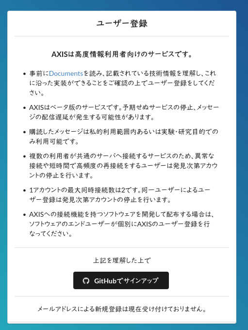
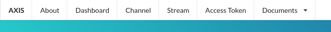
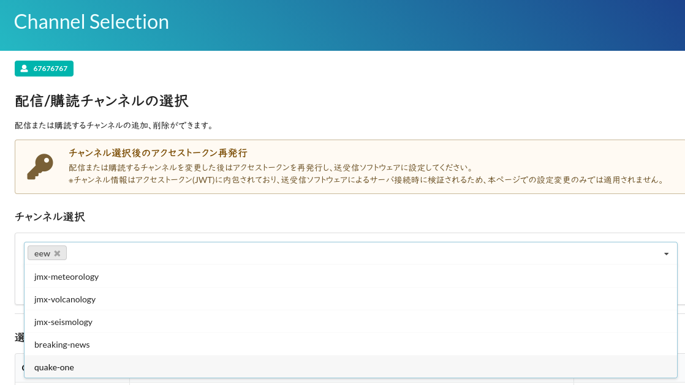
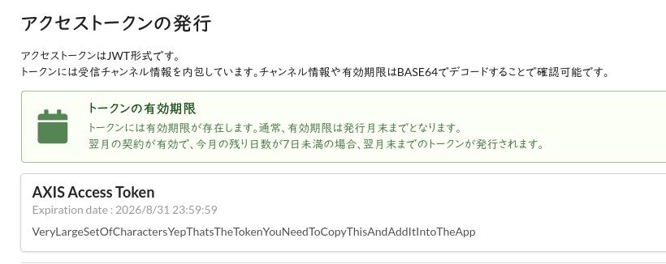

# AXIS 緊急地震速報

[ [English](./AXIS-about-en.md) | **日本語** ]

<a href="https://axis.prioris.jp/">AXIS</a>は、WebSocketを介して緊急地震速報（EEW）を配信する無料サービスです。
KyoQuakeをAXISに接続することで、緊急地震速報を受信することができます。

## 重要な
 
- AXISはベータテスト中。想定外のエラーが発生する可能性があります。
- AXISで受信した情報の再配信、転載、複製、改変、商用利用は禁止されています。
- 動画などを録画･配信している（SNSで）方は十分注意してください。
- KyoQuakeでの実装も同様に実験的なものです。問題があればご報告ください

## 使用方法

まず、AXISのアカウントが必要です。まだお持ちでない場合は、[登録](https://axis.prioris.jp/accounts/signup/)してください。 

### 登録する

AXISを利用するには、[GitHub](https://github.com/)のアカウントが必要です。

### チャンネルを選択する

緊急地震速報を受信するには、チャンネルを`eew`に設定する必要があります。上部のバーにある「Channel」をクリックしてください。

ドロップダウンから「eew」を選択し、「変更」をクリックしてください。

### トークンを取得する

*トークンの有効期限が切れた場合は、こちらから新しいトークンを取得できます。*

上部のバーにある「Access Token」をクリックしてください。「AXIS Access Token」の下に、多数の文字が表示されます。それを選択してコピーしてください。

これで、KyoQuake設定の「AXIS Token • トークン」の下にそれを貼り付けて、緊急地震速報を有効にすることができます。

*エラーが発生した場合は、トークンを正しくコピー＆ペーストしたか確認してください。*

## トークンの有効期限

AXISトークンは毎月月末に失効します。ブラウザ環境におけるセキュリティ上の制限（CORS）のため、現時点ではトークンを自動的に更新する安全な方法がなく、他の手段を用いて更新する必要があります。

AXIS dashboardから新しいものを取得するか、トークンを自動的に更新する[KyoshinEewViewer](https://svs.ingen084.net/kyoshineewviewer/)を使用することができます。

*AXISとは最大2つの同時接続が可能なので、KyoQuakeと別のアプリ（KEVIなど）を同時に利用することができます。*
