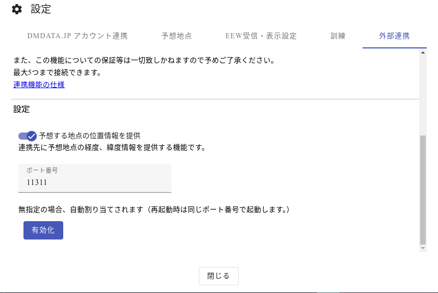
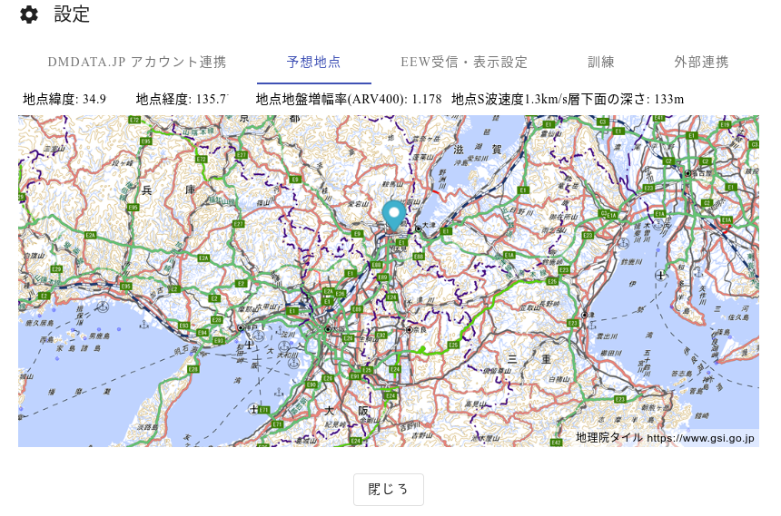

# EEW Client by DMDATA.JP EEW

[ **English** | [日本語](./EEWC-about-ja.md) ]

<a href="https://dmdata.jp/eewclient/">EEW Client</a> is an application and service by <a href="https://dmdata.jp/">Project DM-D.S.S</a>. 
By connecting KyoQuake to EEW Client, you can recieve EEWs.

## Important

- EEW Client is a paid service that requires a subscription. (see below)
- Commercial use or reproduction of data recieved by EEW Client is prohibited.
- Usage in social media (videos, livestreams, etc.) requires that the use of EEW Client is clearly stated. This is fulfilled by KyoQuake by listing EEW Client as the Source in EEW info, but mentionning and linking to EEW Client (in video descriptions, etc.) is recommended.
- More details <a href="https://dmdata.jp/docs/eewclient-external-server">here (Japanese)</a>.

## How to use

### Setup

Firstly, setup, install and run EEW Client <a href="https://dmdata.jp/eewclient/">here</a>. Version 1.4.0 or newer is required. 
Once the app is open, open the settings panel, and navigate to the last tab '外部連携'. 

Under 'ポート番号', write a port number. If you're not sure, use `11311`. 
Then, click the blue button '有効化' to start running EEW Client's external service. 
*Recommended: Also check on the option '予想地点...' above.* 

If it's working properly, it should show 'WebSocket URL' with a red button.

**Important:** EEW Client needs to remain running to be able to send off EEWs to KyoQuake. If it is closed, the local WebSocket connection will also be closed. 

Now, you can copy the port number to KyoQuake's settings and enable EEW.

### Subscription and Account

To recieve EEWs in EEW Client, you need either:
- A subscription to the EEW Client service (550 JPY/month)
- The EEW (forecast) API scope subscription (1650 JPY/month)

Then, you need to link your DM-D.S.S account in EEW Client's settings, first tab.
*On DMDATA.JP's account linking confirmation page, hit the second, white button at the bottom to confirm.*

### Configuration

It is recommended to change some of EEW Client's settings.

**1.** Home location 
You can set your home location in the second tab '予想地点'. Move the map and click to select your home location. 
*KyoQuake can sync your home location from EEW Client, but not the other way around, so it's important to set it here.*

**2.** Low-accuracy EEW 
EEW Client can recieve low-accuracy EEWs if the setting in enabled. 
In the third tab 'EEW 受信', scroll to '1点計算の予想を表示する' and enable the setting.

**3.** Tests 
You can test functionality of the EEW Client connection by running a test scenario in the fourth tab '訓練'.

*EEW Client supports up to five connections to the local WebSocket, so you can use it with apps other than KyoQuake at the same time.*
